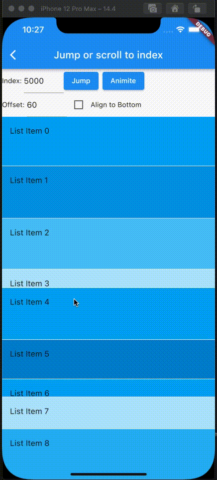
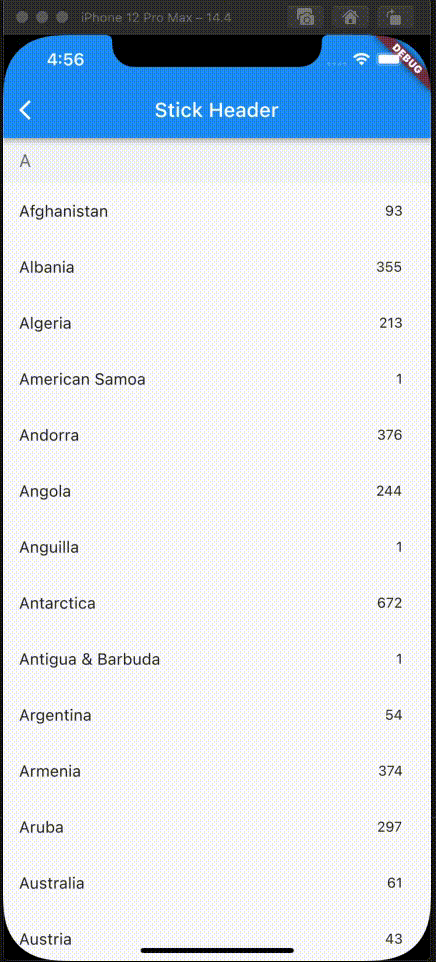
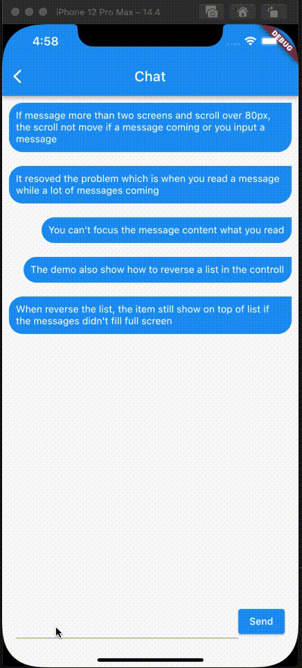
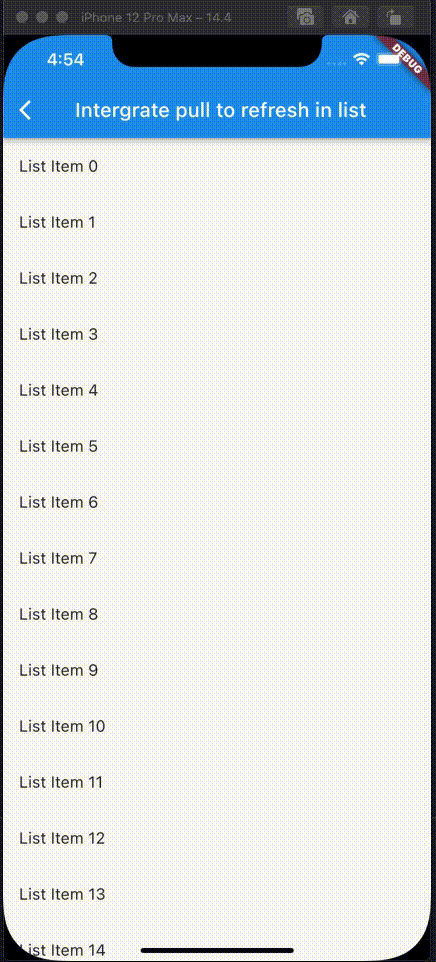

## Flutter List View

I don't like official list view. There are some features don't provide and jumpTo performance is not good. I rewrite the list supported these features in [Features] sections

## Features

1. Support jump to index  
   Jump to index is not support in listview. But it is useful function 
2. Support keep position  
   If some data insert before other items, It will scroll down. Some chat software may want to keep the position not scroll down when new message coming.
3. Support show top in reverse mode if the data can't fill full viewport.
4. Support header sticky
5. Support integrate pull_to_refresh
6. Support scroll to specify index when initialize data
7. Performance  
   When listview jump to somewhere, The items which layout before the position will always loaded. It is not realy lazy loading.

## Screen
|  |  |
| :-----:| :----: |
|  |  |
|  |  |

## Example
```dart
FlutterListView(
      delegate: FlutterListViewDelegate(
    (BuildContext context, int index) =>
        ListTile(title: Text('List Item ${data[index]}')),
    childCount: data.length,
  ))
```
### Jump to index
```dart
flutterListViewController.jumpToIndex(100);
```
OR
```dart
/// Declare
FlutterListViewController controller = FlutterListViewController();
...
controller.sliverController
                      .jumpToIndex(100);
...
FlutterListView(
  controller: controller,
  delegate: FlutterListViewDelegate(
    (BuildContext context, int index) => Container(
      color: Colors.white,
      child: ListTile(title: Text('List Item ${data[index]}')),
    ),
    childCount: data.length,
  ))
```

### Keep Position
```dart
_renderList() {
  return FlutterListView(
      reverse: true,
      delegate: FlutterListViewDelegate(
          (BuildContext context, int index) => Align(
                alignment: Alignment.centerRight,
                child: Padding(
                  padding: const EdgeInsets.all(10.0),
                  child: Container(
                    decoration: const BoxDecoration(
                        color: Colors.blue,
                        borderRadius: BorderRadius.only(
                            topLeft: Radius.circular(20),
                            bottomLeft: Radius.circular(20),
                            bottomRight: Radius.circular(20))),
                    child: Padding(
                      padding: const EdgeInsets.all(10.0),
                      child: Text(
                        chatListContents[index].msg,
                        style: const TextStyle(
                            fontSize: 14.0, color: Colors.white),
                      ),
                    ),
                  ),
                ),
              ),
          childCount: chatListContents.length,
          onItemKey: (index) => chatListContents[index].id.toString(),
          keepPosition: true,
          keepPositionOffset: 80,
          firstItemAlign: FirstItemAlign.end));
}
```

### Sticky header
```dart
Widget _renderHeader(String text) {
  return Container(
    color: const Color(0xFFF3F4F5),
    child: Padding(
      padding: const EdgeInsets.symmetric(horizontal: 16.0, vertical: 12.0),
      child: Text(
        text,
        style: const TextStyle(fontSize: 18, color: Color(0xFF767676)),
      ),
    ),
  );
}

Widget _renderItem(CountryModel itemData) {
  return Padding(
      padding: const EdgeInsets.only(right: 12.0),
      child: ListTile(
          title: Text(itemData.name), trailing: Text(itemData.phoneCode)));
}

@override
Widget build(BuildContext context) {
  return Scaffold(
    appBar: AppBar(title: const Text("Stick Header")),
    body: FlutterListView(
        delegate: FlutterListViewDelegate(
          (BuildContext context, int index) {
            var data = _countries[index];
            if (data is AlphabetHeader) {
              return _renderHeader(data.alphabet);
            } else {
              return _renderItem(data as CountryModel);
            }
          },
          childCount: _countries.length,
          onItemSticky: (index) => _countries[index] is AlphabetHeader,
        ),
        controller: controller),
  );
}
```

### Integrate pull_to_refresh
```dart
@override
Widget build(BuildContext context) {
  return Scaffold(
    appBar: AppBar(
      title: const Text("Intergrate pull to refresh in list"),
    ),
    body: SmartRefresher(
      enablePullDown: true,
      enablePullUp: true,
      header: const WaterDropHeader(),
      footer: CustomFooter(
        builder: (context, mode) {
          Widget body;
          if (mode == LoadStatus.idle) {
            body = const Text("pull up load");
          } else if (mode == LoadStatus.loading) {
            body = const CupertinoActivityIndicator();
          } else if (mode == LoadStatus.failed) {
            body = const Text("Load Failed!Click retry!");
          } else if (mode == LoadStatus.canLoading) {
            body = const Text("release to load more");
          } else {
            body = const Text("No more Data");
          }
          return SizedBox(
            height: 55.0,
            child: Center(child: body),
          );
        },
      ),
      controller: _refreshController,
      onRefresh: _onRefresh,
      onLoading: _onLoading,
      child: FlutterListView(
          delegate: FlutterListViewDelegate(
        (BuildContext context, int index) =>
            ListTile(title: Text('List Item ${data[index]}')),
        childCount: data.length,
      )),
    ),
  );
}
```